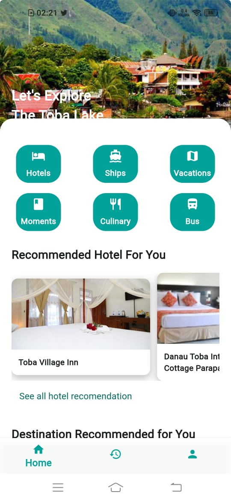
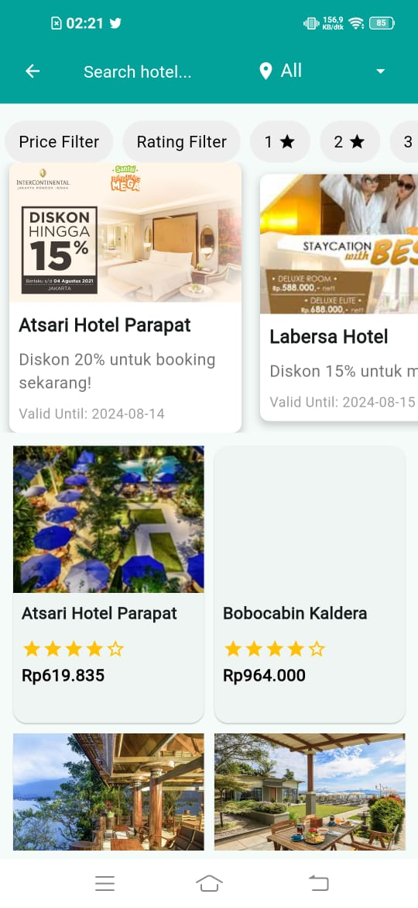
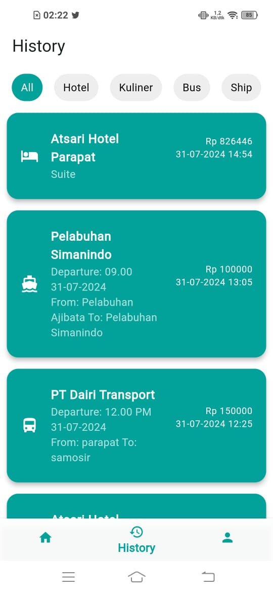

# GoToba Travel Booking App

This is a mobile application that offers booking services for **hotels**, **boats**, and **buses** specifically for the **Danau Toba** region in **North Sumatra, Indonesia**. The app is built using **Flutter** for the front-end and **Firebase** for the back-end, utilizing **Firestore** for real-time data storage and **Firebase Storage** for storing media such as images.






## Features

### 1. **Hotel Booking**

- View a list of available hotels in the Danau Toba area.
- Check hotel details such as name, address, room types, and prices.
- Book a hotel directly through the app.

### 2. **Boat Booking**

- Get information about boat schedules and availability for trips around Danau Toba.
- Make bookings for boat trips conveniently within the app.

### 3. **Bus Booking**

- View bus routes and schedules to various destinations around Danau Toba.
- Book bus tickets directly through the app.

### 4. **Booking History**

- Users can view their past bookings for hotels, boats, and buses.
- Easily check the details of past reservations for quick reference.

## Technologies Used

- **Flutter**: A cross-platform framework for building mobile apps for both **Android** and **iOS**.
- **Firebase**:
  - **Firestore**: A NoSQL cloud database used for storing and syncing data in real-time.
  - **Firebase Storage**: Used to store images, documents, and other media content.
- **Dart**: Programming language used to write the app code.

## Installation

Follow these steps to set up the project on your local machine:

### 1. Clone the Repository

To clone the project to your local machine, use the following Git command:

```bash
git clone https://github.com/zagasaki/sistem-rekomendasi-pariwisata-danau-toba.git
```

### 2. Install Dependencies

Once you have cloned the project, navigate to the project directory and install the necessary dependencies:

```bash
cd repository-name
```

```bash
flutter pub get
```

### 3. Set Up Firebase

Create a Firebase project: Go to the Firebase Console, create a new project, and follow the instructions to add your app to Firebase.
Configure Firebase for your app: For Android, download the google-services.json file and place it in the android/app directory.
Enable Firestore and Firebase Storage: Make sure that Firestore and Firebase Storage are enabled in the Firebase console and correctly linked to your app.

### 4. Run the app

To run the app on an emulator or physical device, follow these steps:

Make sure Android Studio is installed and set up.
Open an emulator or connect your Android device via USB.
Run the app with the following command:

```bash
flutter run
```
